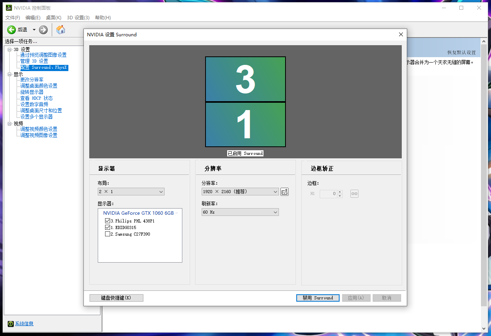

# 贺州舞萌 DX 比赛选曲 OBS 控制器（后端）

## 说明

基于 `obsws-python` SDK 与本地 OBS Studio 通信，通过预编好的场景动效实现选手台上曲目展示的演出效果。

运行DEMO：[https://www.bilibili.com/video/BV1YW42197LT](https://www.bilibili.com/video/BV1YW42197LT)

## 前期准备

1. 下载并安装 [OBS Studio](https://obsproject.com/). 如果您的 OBS Studio 版本为 `27` ，请额外下载 [OBS WebSocket 插件](https://obsproject.com/forum/resources/obs-websocket-remote-control-obs-studio-using-websockets.466/)。
2. 调整输出分辨率为 `1920 × 1080`.
3. 新建两个场景，用于编排 1P 和 2P 的输入源。
4. 在两个场景中分别添加 1 个图像输入源，定位媒体至待机屏图片。
5. 在两个场景中分别添加 1 个图像输入源，分别定位媒体至对应玩家 P 位的选曲图片。
6. 在两个场景中分别添加 1 个媒体输入源，定位媒体至过场遮罩视频，遮盖住双方玩家的选曲即可。

注意：以上场景和输入源的名称最好不要出现中文字符或特殊符号。各输入源的 DEMO 可从 [此链接](https://pixeldrain.com/u/vHSjK5YA) 获取。

## 安装及运行

1. 通过 `git clone` 或下载代码包到本地。
2. 进入项目目录，使用 `pip install -r requirements.txt` 下载所需依赖。
3. 通过 [此链接](https://pixeldrain.com/u/q9xBUFbk) 下载图片资源包，放入项目的 `data` 目录中。
4. 复制一份 `example.env` 并重命名为 `.env`，打开并将配置修改成您本地的 OBS WebSocket 连接配置和场景名称。
5. 通过 `python manage.py runserver` 启动服务。
6. 使用任意 WebSocket 客户端，连接 `ws://<your_ip>:8000/ws/obs_control/` .
7. 按照 [请求体](doc/request.md#请求体) 和 [接口列表](doc/request.md#接口列表) 执行请求，即可完成 OBS Studio 的控制。

## 改进方案

若您的设备支持 NVIDIA Surround，则可以将机台的两个显示屏拼合为一个显示矩阵。此时，将 OBS Studio 的输出分辨率设置成 `1920 × 2160`，并在项目的 `.env` 中设置 `USE_NVIDIA_SURROUND = true`，即可在同一个场景编排、控制双方的选曲展示。

## 请求接口一览

[详见此文档](doc/request.md)。

## LICENSE

(C) 2024 HMT - Hezhou mai Team, build with LOVE & PASSION by KIO & 3.80GHz, under MIT License.
